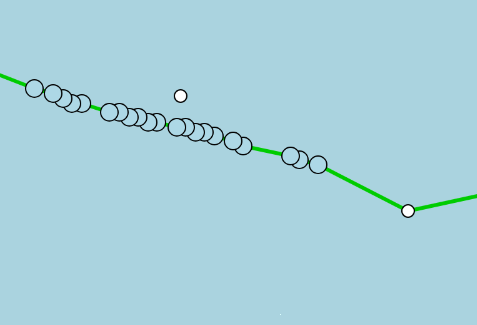
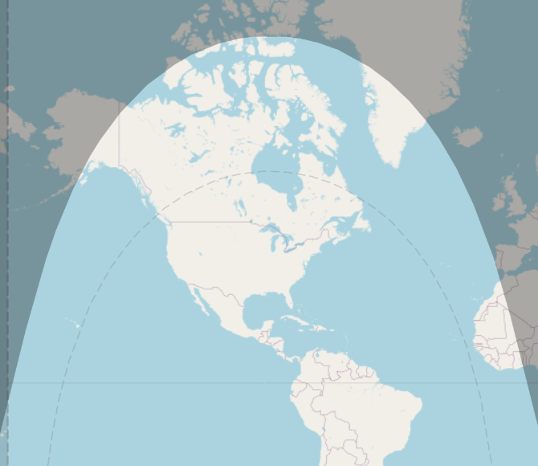
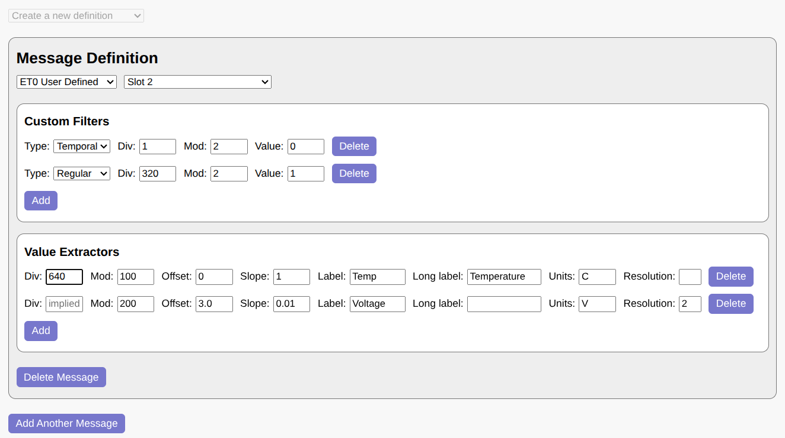
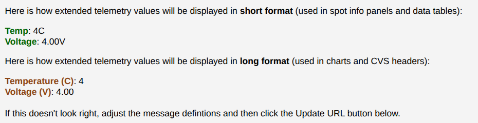
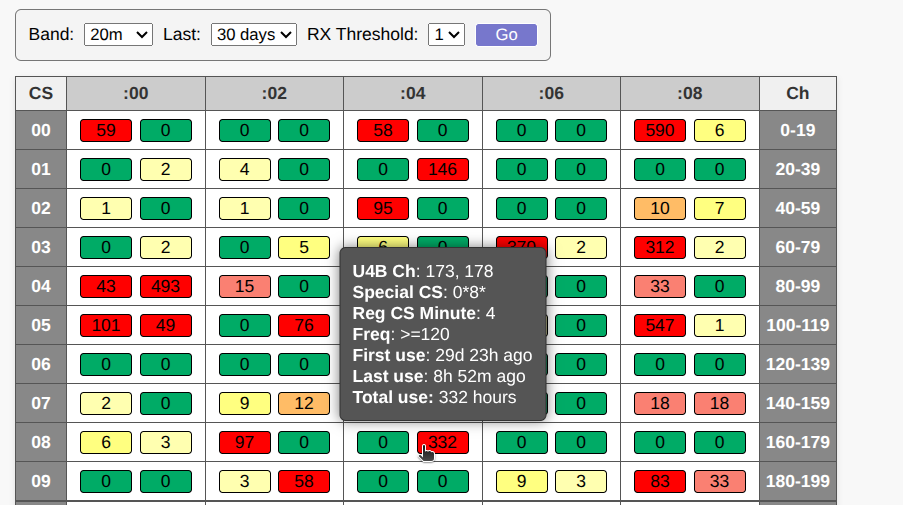

# WSPR TV User Guide

[**WSPR TV**](https://wsprtv.com) is an open-source telemetry viewer for 
several WSPR-based protocols. While the user interface is designed to be 
as intuitive as possible, this guide explains some of the site's more 
advanced features.

## Returning to This Page

If you ever forget something and need to return to this page, the band 
selection menu in the control panel (where you specify the HF band) has 
a `User Guide` option at the top.


There are several other links in the band menu:

- `History` -- displays recently viewed telemetry.
- `Channel Map` -- shows
[activity](https://wsprtv.com/tools/channel_map.html) on U4B channels.
- `ET Wizard` -- opens the
[U4B Extended Telemetry Wizard](https://wsprtv.com/tools/et_wizard.html).

Additionally, a small WSPR TV 
[link](https://github.com/wsprtv/wsprtv.github.io) next to the OSM 
attribution in the bottom-right corner of the screen links to the 
project's GitHub repository.

## Control Panel

The control panel in the top-left corner of the screen contains most of 
the parameters for telemetry visualization.


### Callsign

This is typically a 4-6 character callsign such as `AB1CDE`. However, 
for protocols that use a combination of type 2 / type 3 WSPR messages 
(see below), a suffix or a prefix can also be specified: `P/AB1CDE` or 
`AB1CDE/S`.

### Channel

This field encodes both the protocol and the channel identifier. The 
following formats are supported:

- **U4B [`<CH>`]**. U4B is a commonly used telemetry protocol that 
encodes 6-character Maidenhead grid location, altitude, speed, voltage, 
and temperature through a pair of sequential type 1 WSPR messages. The 
first message is a "regular" callsign message, while the second message 
uses unallocated callsign space starting with `Q`, `0`, or `1`. `<CH>`
is a number between 0 and 599 representing the first and third 
characters of the special callsign, the starting minute, and one of 4
frequency "lanes".

  Example: `459` on the 10m band indicates transmissions that use Q\*2\* 
special callsigns, begin 2 minutes into the 10-minute cycle, and 
transmit in the last 40 Hz of the band.

  Additional special callsign messages may follow in slots 2-4, 
representing **extended telemetry (ET)**. Extended telemetry is 
discussed in detail [below](#u4b-extended-telemetry).

  U4B channels are allowed to have a `V<variant>` suffix, such as 
`321V100`, to enable
[certain experimental extensions](#u4b-experimental-extensions).

- **U4B [`U<CS1><CS3><M>`]**. This is an alternative U4B channel 
representation that specifies the first and third characters of the 
special callsign (`<CS1>` and `<CS3>`) as well as the starting minute
(`<M>`) explicitly. Unlike the numeric channel format, this 
representation does not include frequency lane information.

  Example: `UQ22` corresponds to channel 459 (and also 454, 449, etc.) 
on the 10-meter band. It indicates Q\*2\* special callsigns and a starting
minute of 2.

- **Generic 1 [`g<M>`]**. This is the simplest type of telemetry, 
consisting of a single type 1 WSPR message. Location is indicated by a 
4-character Maidenhead grid locator and provides ~70x100 mi spatial 
resolution. No other attributes, such as altitude or speed, are encoded. 
`<M>` is the starting minute (must be one of 0, 2, 4, 6, or 8).

  Example: `g2` if transmissions begin 2 minutes into the 10-minute cycle.

- **Zachtek 1 [`z<M>`]**. This is an older Zachtek protocol that is 
similar to `Generic 1` but also coarsely encodes altitude in the WSPR 
message's power field (resolution ~1 km).

  Example: `z8`.

- **Generic 2 [`G<M>`]**. This encoding uses a pair of type 2 / type 3 
WSPR messages. The first message encodes a compound callsign, while the 
second message adds a 6-character Maidenhead grid locator, improving 
spatial resolution to ~3x4 mi. No other attributes are encoded. Both 
messages must be received for a spot to be decoded. `<M>` is the starting
minute (must be one of 0, 2, 4, 6, or 8). 

  Example: `G4` if the first (type 2) message is transmitted 4 minutes
into the 10-minute cycle.

- **Zachtek 2 [`Z<M>`]**. A newer Zachtek protocol that is similar to 
`Generic 2`. The power fields of both WSPR messages are used to encode 
the altitude to a resolution of ~60 m.

  Example: `Z6`.

- **WB8ELK [`W<CS1><CS3><M>`]**. Transmitted via a pair of type 1 
messages. The second message uses special `Q/0/1` callsigns similar to 
`U4B`, although the encoding is completely different. Provides altitude 
to ~60 m resolution, voltage, and approximate number of GPS satellites 
(not displayed by WSPR TV). Location is a 6-character Maidenhead grid 
locator (~3x4 mi resolution). `<CS1>` and `<CS3>` are the first and 
third characters of the special callsign. `<M>` is the starting minute
(must be one of 0, 2, 4, 6, or 8).

  Example: `WQ46` if Q\*4\* special callsigns are used and 
transmissions begin 6 minutes into the 10-minute cycle.

If the channel field is **empty**, all regular callsign messages are 
displayed. The callsign may be compound. Spots are shown without 
filtering in this mode, and no line segments between markers are drawn.

For new designs, prefer the U4B protocol. Not only is it well-documented 
and capable of packing more values into two sequential WSPR messages, 
but it also correctly reports TX power in the regular callsign 
transmission (this data is used in radio propagation studies).

### Band

Specifies the frequency band for WSPR transmissions. There may be 
additional, band-unrelated options at the end of this menu, such as a 
link to this user guide.

### Start Date

The start date should be in the `YYYY-mm-dd` format,
such as `2025-07-15`. This field defaults to 30 days before today and is 
a good choice for minimizing the load on WSPR Live servers and making 
the WSPR TV user interface more responsive. The start date normally cannot 
be more than a year before the end date (specified via a URL parameter, see 
below). For historical telemetry, you can specify a start date over a 
year ago by appending the appropriate `end_date` parameter to the URL.

The "From:" label (to the right of the start date field) is a link
to the [History](../tools/history.html) page.

## URL Parameters

Because WSPR TV is optimized for use on mobile devices with small 
screens, the control panel includes only the most commonly used 
telemetry parameters. Additional parameters may be specified by 
appending them to the URL using the `param1=value1&param2=value2` 
format.

- **end_date=`<YYYY-mm-dd>`** specifies the end date (up to 23:59:59)
for a track. `end_date` defaults to today and cannot be less than
`start_date` or more than a year after `start_date`, unless `ate1y`
is also present.

- **ate1y** (abbreviation for "allow tracks exceeding 1 year",
no value needed) allows tracks to be up to 2 years long. Use this
parameter only when absolutely necessary.

- **time=`<utc|local>`** causes timestamps to be displayed in UTC
or local timezone (default). There are other ways to change time
display in WSPR TV (see [below](#time-display)).

- **units=`<metric|imperial>`** specifies the display units. There are 
other ways to switch units in WSPR TV (see [below](#unit-conversion)).

- **detail=`<0|1>`** controls the amount of detail shown in the data view.

- **dnu** (abbreviation for "do not update", no value needed) instructs 
WSPR TV not to update the track every 10 minutes. `dnu` is implied if 
`end_date` is in the past. Adding this parameter may make sense when 
sharing WSPR TV links widely to minimize the additional load on WSPR 
Live servers.

- **detach_grid4** (no value needed) removes low-resolution (grid4)
spots from the track. Removed spots can still be seen in the data table
and on the map with `show_unattached`.

- **show_unattached** (no value needed) causes WSPR TV to display
spots that are not attached to the track.

- **sun_elev=`<degrees>`** displays a solar isoline on the map that 
corresponds to the solar elevation. This is useful for estimating when 
a balloon may start or stop transmitting, assuming its location is 
approximately known. See more [below](#solar-isoline).

The callsign, channel, start date, and band can be specified as URL 
parameters as well (using `cs`, `ch`, `start_date`, and `band` 
respectively) and will pre-fill the control panel parameters. Example: 
`cs=AB1CDE&ch=321&band=10m&start_date=2025-07-15`.

Extended-telemetry-related URL parameters `et_dec`, `et_labels`, 
`et_llabels`, `et_units`, and `et_res` are discussed in the
[Extended Telemetry section](#u4b-extended-telemetry) of this guide.

## Map View

A track is rendered as a sequence of small white grid4 markers (low 
resolution) and larger light blue grid6 markers (high resolution).
Enhanced U4B telemetry spots (see [below](#u4b-extended-telemetry)
are shaded in a darker blue. Markers are connected by green lines.


Note that some spots may be **unattached** (i.e., not shown as
part of the track) for one of the following reasons:

- A U4B spot has the `gps_valid` bit set to 0. If shown on the map, 
these spots are colored light red.
- A grid4 (low-resolution) spot is located near a grid6 
(high-resolution) spot.
- A spot has unusual characteristics, such as an improbable location 
relative to adjacent spots.
- The channel field is blank (unknown telemetry protocol).

Unattached spots are always displayed in the data view. They are also
shown on the map when the `show_unattached`
[URL parameter](#url-parameters) is set.



One peculiarity of the mapping framework used by WSPR TV (Leaflet) is 
that data is not duplicated across the antimeridian (i.e., -180/180 
longitude). Therefore, as you pan, you may suddenly notice the track 
disappear from view. This is not a bug -- the track is still there, but 
it's now on the other side of the map (zoom out to see it). WSPR TV 
provides a visual cue when you are close to the antimeridian: the 
antimeridian is shown as a dashed line, and the side of the map that has 
no data is shaded in grey.


The Equator is shown as a grey horizontal line. The first spot in the 
track (after `start_date`) is green, while the last one is red. Night / 
day regions are indicated on the map by grey shading.

### Spot Info

Hovering over a spot (or touching it on a mobile device) brings up the 
Spot Info panel. This displays most of the available telemetry, 
including raw WSPR messages, reception statistics, and up to 8 extended 
telemetry values.


*Clicking* on a spot (vs. hovering) also opens the Spot Info panel, but 
now the panel remains open when you move away from the spot, and 
additional information is displayed:

- A Google Earth link to see "what the balloon is seeing", with the 
camera positioned at the correct latitude, longitude, and altitude, and 
facing East. Once in Google Earth, holding `CTRL` while pressing the 
arrow keys (left, right, etc.) allows you to "look around" without 
moving the position of the camera.

- RX stations, shown as yellow dots and connected by blue lines. When 
hovering over an RX marker, the callsign of the receiving station, 
distance, and signal strength are shown.


To close the Spot Info panel, click or touch anywhere on the map outside 
of a marker.

### Flight Synopsis

A summary of telemetry is displayed in the control panel below the 
parameter fields. These should be self-explanatory. The track updates 
automatically every 10 minutes (unless `end_date` is in the past or the 
`dnu` URL parameter was used), and the time of the next update is shown 
in light yellow.


Some of the values in the Flight Synopsis also serve as **toggles** --
clicking on the distance, altitude, or speed (e.g. 25313 mi in
the example above) switches units from imperial to metric or vice
versa. Clicking on `(12m ago)` in the example above toggles UTC time
display. These preferences will be remembered if you return to the page
later.

Allowing the map to update itself is by far the most efficient way to 
view real-time data. Do not refresh the page via the browser -- doing so 
results in considerably more load on WSPR Live servers. Periodic updates 
are already timed to occur at the optimal time -- roughly 75 seconds 
after the last message in a TX sequence is received (it takes some time 
for WSPR messages to trickle into the WSPR Live database).

### Auxiliary Info

Clicking anywhere on the map outside of a marker brings up the Auxiliary 
Info bar in the bottom-left corner of the screen.


The displayed values include:

- The latitude and longitude of the clicked location (43.07, -52.78 in 
the example above)
- Current sun elevation at the clicked spot (20°)
- Time since sunrise at the clicked spot (12.4 hours, can be negative 
during the night)
- Time until sunset at the clicked spot (2.0 hours, can be negative 
during the night)
- If a track marker was already selected, the great circle distance 
between that marker and the clicked spot (157 miles)

### Solar Isoline

A dotted line marks the region where the Sun's elevation exceeds a certain 
value. This value can be set using the 
[sun_elev URL parameter](#url-parameters) or computed automatically from
recent flight data as the lowest Sun angle at which transmissions 
occurred. To disable this feature, add `sun_elev=off` to the URL.



## Data View

Clicking on the chart icon (in the top-left corner, below the map zoom 
buttons) will close the map view and open the data view. The data view 
contains:

- A variety of charts for all tracked telemetry values, including 
extended telemetry.
- A table showing all received spots, including grid4 spots not 
displayed on the map.
- Buttons to export spots as a CSV table, all raw data as a JSON file, 
and to switch units and time format (from UTC to local).
- A button to display / graph more data, such as computed speed and 
vertical speed.


To return to the map view, click on the `X` icon in the top-right corner 
of the screen.

The map will continue to update every 10 minutes while the data view is 
open, but the data view currently does not update periodically. To see 
fresh values, switch to the map view and then back to the data view.

### Chart Controls

The charts are interactive and can be zoomed in and out:

- To zoom in on the X-axis: click on a starting point and then drag left
or right (without changing the Y position by more than 20 pixels). You 
will see a horizontal slice of the chart being selected.


- To zoom in on the Y-axis: click on a starting point and then drag up
or down (without changing the X position by more than 20 pixels). You 
will see a vertical slice of the chart being selected.


- If you click and drag left or right, and then drag up or down by more 
than 20 pixels (while still clicking), a rectangular area of the chart 
will be highlighted. If you selected a rectangular area by mistake, drag 
to minimize the unwanted dimension to 0; this will revert the selection 
to either a horizontal or vertical slice.


- To zoom out to the original (full) view, double click anywhere on the 
chart.

On mobile devices, charts support **touch gestures** such as drag-to-pan 
and pinch-to-zoom.

### Telemetry Detail

By default, only the core telemetry values are shown in the data view 
(e.g., speed, altitude, temperature, and voltage for U4B). The
`Show More` button can graph / display several additional fields:

- Computed values, such as computed speed (based on location changes 
over time) and vertical speed (i.e., rate of ascent / descent). These 
may not be available for every spot, due to computational uncertainty. 
Moving from one 6-character grid to the next can mean covering a 
distance of 0.1 miles or 7.9 miles. For this reason, waiting until the 
location has changed over several grids can be necessary for reasonably 
accurate (+/- ~10%) speed estimates.

- RX statistics, such as the number of receiving stations for each spot, 
maximum SNR, and maximum RX distance.

- The TX power field reported by WSPR, but only for the U4B protocol and 
only if the values differ from spot to spot.

Telemetry detail can also be set with the `detail`
[URL parameter](#url-parameters).

### Time Display

The `Toggle UTC` button switches time display from UTC to local (local
here refers to your device's timezone, not the balloon's location). 
The preference affects all displayed, charted, and CSV exported values
in both the map and data views, and is remembered across browser sessions.

Another way to toggle time display is to click on the `(X ago)` value in
the control panel of the map view.

### Unit Conversion

The `Toggle Units` button switches units from metric to imperial and 
vice versa. The preference affects all displayed, charted, and CSV 
exported values in both the map and data views, and is remembered across 
browser sessions.

Extended telemetry units are opaque to WSPR TV and are not impacted by 
unit conversion.

Another way to switch units is to click on the `Distance`, `Speed`, or
`Altitude` values in the control panel of the map view.

### Data Export

The `Export CSV` button exports the data view table exactly as it is 
displayed (in currently selected units, in the same field order, etc).

The `Get Raw Data` button returns the entire telemetry dataset as a 
tree-like JSON object. This includes raw WSPR messages and per-spot RX 
information.

Example of a raw record:

```
{ "slots":[
     {"ts":"2025-06-02T05:06:00.000Z",
      "cs":"AB1CDE",
      "grid":"JL88",
      "power":7,
      "rx":[{"cs":"DK6UG","grid":"JN49cm","freq":28126141,"snr":-21} ...]},
     ...more slots],
  "ts":"2025-06-02T05:06:00.000Z",
  "grid":"JL88mt",
  "speed":51.856,  // in km/h
  "voltage":3.7, // in V
  "temp":-6,  // in C
  "altitude":13560,  // in meters
  "lat":28.8125,
  "lon":17.041
}
```

Raw data is always exported in metric units and does not depend on the 
current unit selection.

The format of raw records may change in future versions of WSPR TV.

## U4B Extended Telemetry

The U4B protocol includes a provision for transmitting extended 
telemetry as additional `Q/0/1` messages. The informational content of 
each WSPR message is first converted to a so-called `BigNumber` -- a 
value ranging from 0 to 389,512,281,599 (approximately ~38.5 bits). The 
least significant bit of this message (`HdrTelemetryType`) is set to 1 
for basic U4B telemetry and 0 for extended telemetry. As a result, 
extended telemetry messages provide approximately 37.5 bits of raw 
payload.

### Generic ET

Generic ET contains a single header after `HdrTelemetryType`, followed
by an opaque ~35.2 bit value:

```
HdrSlot - 5 values, meant to prevent interference between adjacent U4B channels
```

Note that in Generic ET, `BigNumber` is encoded differently than in legacy
ET (ET0). If `v` is `BigNumber` with the least significant bit removed
(it is always 0 for extended telemetry), the following transformation of
`v` is needed before `BigNumber` is sent over the wire:

```
v = (v / 320) * 320 + (v % 5) * 64 + ((v / 5) % 4) + ((v / 20) % 16) * 4
```

This transformation is necessary for compatibility with ET0, where
`HdrSlot` was originally placed in the middle of `v`.

### Traquito's ET

Traquito's extended telemetry (ET0) is a subtype of Generic ET,
because it also starts with `HdrSlot`. ET0 adds the following
structure on top of the opaque data blob:

```
HdrRESERVED - 4 values, set to 0 (used as the protocol version number)
HdrType - 16 values, of which only 0 (USER_DEFINED) and 15
(VENDOR_DEFINED) are specified
```

Traquito's headers use up ~8.3 bits (320 values), with approximately 
29.1 bits remaining for user data.

### Value Packing / Unpacking

First, let’s review how values are packed into a message. To append a 
value in the range [0, n), we multiply the existing message by n, then 
add the new value. The multiplication shifts the current message left, 
creating space, while the addition inserts the new value at the end.

The inverse process -- unpacking -- uses **division** and **modulus**. 
The modulus (i.e., the remainder from division) extracts the value from 
the end of the message, while the division shifts the message right, 
effectively removing the extracted value.

As an example, suppose a message ends with three packed values: 
`value3`, `value5`, and `value7`, where each spans a specific range -- 
`value3` in [0, 3), `value5` in [0, 5), and so on.

To unpack `value3`, we first shift the message right by dividing it by
5 * 7, which removes `value5` and `value7`, and moves `value3` to the end. 
Then, we apply a modulus of 3 (i.e., take the remainder after dividing 
by 3) to extract the value of `value3`.

### Value Types

Extended telemetry values can be **opaque** or **native**. Opaque values
can be graphed and displayed in a table, but their meaning is otherwise
not known to WSPR TV. By contrast, native values have a well-defined type,
and can influence the site's function at a more fundamental level.

Currently, 10 native types are supported:

- Type 100: enhanced longitude resolution 
- Type 101: enhanced latitude resolution 
- Type 102: enhanced altitude resolution
- Type 103: enhanced altitude range
- Type 104: enhanced temperature resolution
- Type 105: enhanced temperature range
- Type 106: enhanced voltage resolution
- Type 107: enhanced voltage range
- Type 108: enhanced speed resolution
- Type 109: enhanced speed range

These types increase the resolution or range of basic U4B telemetry.
The additional resolution / range depend on the size of the corresponding
extended telemetry fields. For example, if 10 values are allocated to type 102,
altitude resolution improves by a factor of 10, from 20m to 2m. If 3 values are
allocated to type 103, altitude range increases by a factor of 3, from
0 - 21360 meters to 0 - 64080 meters.

Temperature range and voltage range are special in that they extend in both
directions, above the maximum value and below the minimum one. The direction
alternates as the value of the range increases. For example, when type 107
(enhanced voltage range) value is 1, the range spans 5 - 7V. When the value
is 2, the range becomes 1 - 3V. Other ranges, such as speed and altitude,
grow in the positive direction only.

### Extended Telemetry Message Definition

WSPR TV has an extremely flexible extended telemetry definition 
mechanism that is able to decode Generic ET, Traquito's ET0, or any past or
future  protocols that pack values into contiguous (but possibly fractional) 
bits of the U4B `BigNumber`.

More precisely, WSPR TV operates on `BigNumber / 2`, with the least 
significant bit (`HdrTelemetryType`) removed since it is always 0. When 
`BigNumber` is mentioned later in this section, it will always be this 
truncated, 37.5 bit version.

The basic building block of WSPR TV's extended telemetry specification 
is the **message definition**. A message definition includes:

- A set of **filters** that define the conditions a message must meet in 
order to be decoded.
- A set of **extractors** that specify how individual values should be 
extracted from `BigNumber`, linearly transformed, and annotated.

### Filter Specification

All filters in a message definition must pass for value extraction to 
happen. Filters normally express conditions on snippets of `BigNumber`, 
which are usually headers or message type selectors. For example, in the 
ET0 protocol, the following conditions should be true for a message to 
be accepted:

- `HdrSlot` (5 values) is set to the slot in which the ET message was 
received
- `HdrRESERVED` (4 values) is set to 0
- `HdrType` (16 values) is set to the desired type (e.g., 0 for 
`USER_DEFINED`)

The basic filter definition in WSPR TV is the tuple
`(divisor, modulus, expected_value)`
expressing the following condition:

```
(BigNumber / divisor) % modulus = expected_value
```

To support Generic ET, a special variable `slot` is available to represent
the TX slot in which the extended telemetry message was received. This 
allows us to express the filter set for ET0 as follows:

```
(BigNumber / 1) % 5 = slot
(BigNumber / 5) % 4 = 0
(BigNumber / 20) % 16 = 0
```

To explain, we first check that the truncated `BigNumber` (here again we 
refer to our version of `BigNumber` with the `HdrTelemetryType` bit 
removed) was received in the correct slot. To do this, we divide 
`BigNumber` by 1 and then extract the 5 possible values of 
`HdrSlot` field using a modulus of 5. This value has to be equal to 
the special variable `slot`.

We then access the adjacent `HdrRESERVED` field by dividing `BigNumber` by 5 
(this skips over `HdrSlot`) and extracting 1 of 4 possible values 
using a modulus of 4. This value also has to be equal to 0 (for 
ET0).

Finally, we check that `HdrType` is equal to 0. We skip over both the `HdrSlot`
and `HdrRESERVED` fields, hence the division is by 5 * 4 = 20. We use a modulus 
of 16 to extract the 16 possible values. This value also has to be equal to 0 (for
`USER_DEFINED`).

### Temporal Filters

WSPR TV provides a powerful mechanism for multiplexing multiple message 
types within the same slot -- without using any extra bits to indicate 
which schema is in use -- via the `tx_seq` variable.

`tx_seq` represents the transmission slot sequence number, which 
increments every 2 minutes and resets every month. If the GPS **UTC** 
time of the **regular callsign** transmission preceding an extended 
telemetry message is `YYY-MM-DD HH:MM`, `tx_seq` is calculated as 
follows:

```
tx_seq = ((DD - 1) * 720) + (HH * 30) + (MM / 2)
```

For example, on May 3rd at 06:32 UTC,
`tx_seq = (2 * 720) + (6 * 30) + (32 / 2) = 1636`.

This variable can be used instead of `BigNumber` in filters:

```
(tx_seq / divisor) % modulus = expected_value
```

This allows WSPR TV to decode messages differently based on transmission 
time -- for example, every other transmission, during odd-numbered 
hours, or on even-numbered days. Multiple message types can be 
multiplexed into the same ET slot.

Another time-dependent filter uses the variable `slot` and expresses the 
condition:

```
slot = value
```

This enables different handling of messages in, for example, slot 2 
versus slot 3.


### Opaque Value Extraction

Once all filters in a message definition pass, a set of values are 
extracted. Generally, extraction is specified using the following tuple 
of parameters:

```
(divisor, modulus, offset, slope)
```

`divisor` and `modulus` here specify how to extract the raw value from 
`BigNum`, while `offset` and `slope` are used to linearly transform the 
raw value into its decoded form:

```
raw_value = (BigNumber / divisor) % modulus
value = offset + raw_value * slope
```

As an example, suppose an ET0 message has 110 values of `Pressure` in 
its least significant bits, and then 90 values of `Heading` immediately 
after. `Pressure` starts at 0.1 and increments 0.001 Bar with every step, 
while `Heading` starts at 0 and increments by 4 degrees. These values 
can then be extracted as follows:

```
[divisor, modulus, offset, slope]

(320, 110, 0.1, 0.001)
(35200, 90, 0, 4)
```

The divisor here starts at 320 because we need to skip over the ET0 
header (which has 320 values). 35200 is 320 * 110 -- we are skipping 
over both the header and the `Pressure` value.

Because extracted values are often contiguous, a **simplified 3-term 
extractor** specification is also available:

```
(modulus, offset, slope)
```

The divisor here is **implied** by taking the previous divisor and 
multiplying it by the modulus of the previous extractor. In other words, 
the divisor is set to the end of the previous value. If no initial 
divisor is specified anywhere (i.e., all extractors are 3-term), the 
first divisor starts at 1 for unspecified protocols and at the end of 
the headers for known protocols (e.g., initial_divisor = 320 when one of 
the filters in the message definition is `et0`).

For the previous Pressure / Heading example, the extractor specification 
becomes:

```
[modulus, offset, slope]

(110, 0.1, 0.001)
(90, 0, 4)
```

Note that the `(modulus aka num_values, offset, slope)` format differs 
from Traquito's `(min_value, high_value, step_size)`. However, there is 
a straightforward mapping between the two:

```
num_values = 1 + (max_value - min_value) / step_size
offset = min_value
slope = step_size
```

### Value Annotation

Extracted values can optionally be annotated with a
**short label**, **long label**, **units**, and **resolution**:

- **Short label** is a brief, descriptive identifier -- e.g., `VSpeed` 
for "Vertical Speed". It can be up to 32 characters long and may only 
contain alphanumeric characters, spaces, `#`, and `_`. Short labels are 
shown in space-constrained areas, such as Spot Info panels and table 
headers. If not specified, they default to `ET0`, `ET1`, etc.

- **Long label** is a full descriptive name, such as `Vertical Speed`. 
It can be up to 64 characters long and may only contain alphanumeric 
characters, spaces, and the characters `#` and `_`. Long labels are 
shown where more space is available, such as in chart legends. If not 
specified, long labels default to short labels, or to `ET0`, `ET1`, etc. 
if short labels are also missing.

- **Units** indicate the measurement associated with a value (e.g.
`135 km/h`). The leading space in units is preserved (e.g. to specify 
`9 V` vs. `9V`). Units can be up to 8 characters long and may only contain 
letters, spaces, and the characters `/` and `°`. Countable values often 
don't require units: `NumSats: 5` is typically clearer than
`NumSats: 5 sats`.

- **Resolution** specifies the number of digits to show after the 
decimal point. By default, values are displayed as integers (resolution 
= 0). The maximum allowed resolution is 6.

### Native Value Extraction

[Native value](#value-types) extraction is specified using the following
tuple of parameters:

```
(divisor, modulus, type_id)
```

Note that there is no offset, slope, or value annotation, since the
type of the value is already known to WSPR TV.

When the divisor is implied, a **simplified 2-term extractor**
specification is also available:

```
(modulus, type_id)
```

### Extended Telemetry Wizard

WSPR TV provides a [wizard](https://wsprtv.com/tools/et_wizard.html) to 
create new extended telemetry specifications or to import existing ones 
from other formats.



In this example, a single message is defined based on ET0 in slot 2. Two 
additional filters are applied: a temporal filter, which restricts the 
message to even `tx_seq` slots, and a custom selector, which checks that 
the first bit after the ET0 header is 1 (perhaps because the message 
format changes when the bit is 0).

The message contains two values -- Temperature and Voltage -- which 
follow immediately after the selector bit. The first divisor is 640, 
accounting for the ET0 header (320 values) plus the selector bit (2 
values). The second divisor is implied from the location of the previous 
field; if specified explicitly, it would be 640 * 100 = 64000.

Note that if not for the selector bit, the first divisor could be left 
blank as well. It would then default to 320, or the end of the headers 
for the ET0 protocol.

When you click "Generate URL", WSPR TV displays a preview of how the 
extracted values will appear:



You can create as many message definitions as needed, as long as the 
total number of extractors does not exceed 32. Once your message 
definitions are finalized, click "Generate URL" to create the WSPR TV 
link for your extended telemetry specification.

### Extended Telemetry URL Parameters

While most extended telemetry definitions should be generated using the 
[ET Wizard](https://wsprtv.com/tools/et_wizard.html), it can be useful 
to understand how extended telemetry URL parameters are constructed
from a specification.

The `et_dec` URL parameters consists of one or more *decoders*, 
separated by the `~` character:

```
et_dec=<decoder1_spec>~<decoder2_spec>~...
```

Each decoder in turn consists of zero or more filters and one or more 
extractors. The filters are separated from the extractors with 
underscores (`_`), whereas individual filters and extractors are 
separated from each other with commas (`,`):

```
decoder_spec: <filter1>,<filter2>..._<extractor1>,<extractor2>...
```

A filter can have one of the following forms:

```
<divisor>:<modulus>:<expected_value>
t:<divisor>:<modulus>:<expected_value>
s:<slot>

```

with the latter two representing temporal conditions. Shortcuts for
Generic ET and Traquito's user-defined telemetry are available:

```
et
et0:0
```

Hence the filter specification for ET0 user-defined telemetry in slot 2 
may be expressed as follows:

```
et0:0,s:2
```

An opaque value extractor can have either a 3-term or 4-term format,
depending on whether the divisor is explicit or implicit:

```
<modulus>:<offset>:<slope>
<divisor>:<modulus>:<offset>:<slope>
```

Native value extractors specify their type after the modulus:

```
<modulus>:t<type_id>
<divisor>:<modulus>:t<type_id>
```

Finally, a set of annotation parameters -- `et_labels`, `et_llabels`, 
`et_units`, and `et_res` -- can be used to customize the display of opaque ET 
values. All of these are a comma-separated list of parameters, with one 
value per extractor specification. For example, if there are 2 decoders 
containing 4 and 5 extractors respectively, then the 7th item in 
`et_units` corresponds to the 3rd extractor of the second decoder.

Only non-default values need to be specified in the above URL 
parameters. Here is how to assign units to the 4th extractor while 
keeping all the other values unitless.

```
et_units=,,,mph
```

## U4B Experimental Extensions

U4B messages include the `gps_valid` bit, which many trackers always 
set to 1. WSPR TV allows this bit to be repurposed for other uses by 
specifying a version (or variant) in the channel parameter, such as 
`321V100`. The following variants are currently supported:

- **100** [increased speed range] - add 84 knots (156 km/h) to speed 
if `gps_valid = 0`

- **101** [increased altitude resolution] - add 10 meters to 
altitude if `gps_valid = 0`

- **102** [increased longitude resolution] - add 2.5 arcminutes to 
longitude if `gps_valid = 0`

- **103** [increased latitude resolution] - add 1.25 arcminutes to 
latitude if `gps_valid = 0`

## U4B Channel Map

WSPR TV provides a channel map to help users gauge U4B channel activity. 
This map is particularly well-suited for identifying unused channels.



In the table, the columns represent the starting minute of the regular
callsign transmission, while the rows correspond to the first and third 
characters of the special callsign (such as Q1 in QB1ERZ). Each cell 
contains two colored buckets, and each bucket in turn represents two 
U4B channels in adjacent frequency lanes (i.e. one bucket covers 
0-80 Hz while the other 120-200 Hz). Binning of nearby channels is 
necessary because RX frequency errors can easily exceed the 40 Hz width 
of a single U4B channel.

The rightmost column of the table displays the range of U4B channels for 
each row. To locate a specific U4B channel, first identify the row 
containing the range, then scan across that row to find the channel.

**The number in each bucket** indicates how many **unique 1-hour slots** 
contained basic telemetry for that channel during the specified period 
(extended telemetry is excluded). For a slot to be counted, at least two 
basic telemetry transmissions must occur within the hour. This threshold 
helps eliminate noise caused by corrupt messages, non-U4B use of special 
Q/0/1 callsigns, and various other corner cases.

Additionally, an <code>RX Threshold</code> setting is available to 
**filter out single-receiver reports** when set to 2. Basic telemetry 
reported by only one receiver is more likely to have an inaccurate 
frequency, as frequency values are averaged across multiple receivers. 
In some cases, single-receiver reports are also associated with 
incorrectly set receiver clocks, which can result in telemetry being 
assigned to the wrong time slot.

Buckets are color-coded based on their count: **green** indicates that 
no basic telemetry has been observed in any 1-hour slots, while **red** 
represents multiple hours of daily use over an extended period. For 
example, a tracker that transmits for 10 hours every day will show a 
count of about 300 after 30 days. **Yellow and orange** fall in between, 
with yellow in particular sometimes reflecting leakage from a nearby 
busy channel due to RX frequency errors.

While the map may display **some false positives**, it is highly 
sensitive to channel activity and should therefore produce **virtually 
no false negatives**. A transmitter operating for as little as 20 
minutes and detected by a single receiver will change a bucket’s color 
from green to yellow.

This makes the map potentially suitable as a **robust reservation 
mechanism** for U4B channels. Below is a proposed procedure for 
reserving a U4B channel using the map:

- Set the time range to 30 days and set `TX Threshold` to 1.
- Select a random green bucket (or better yet, a cell containing two
green buckets). 
- If you already have an active tracker using your callsign, ensure the 
new bucket has a different starting minute. In other words, **you cannot
have two trackers in the same column of the table**.
- The green bucket will show 2 U4B channels, with the preferred channel 
-- the one that is farther away from the adjacent bucket -- highlighted 
with an asterisk (*).
- Program the selected channel into your tracker and launch it. The 
bucket should turn from green to yellow shortly afterward, signaling to 
others that the channel is now in use.
- If you’re not ready to launch yet, but want to reserve the channel, 
perform a few test transmissions. You can self-report using an SDR 
dongle with WSJT-X or WsprDaemon software. This will mark the channel as 
active for the next 30 days.
- After a tracker stops transmitting, the channel will automatically 
revert to green after 30 days.

Note that this is just a proposal at this time. Other reservation
mechanisms -- such as databases maintained by Traquito, lu7aa and QRP Labs
-- remain in active use. You should not use the channel map for
reservations unless your only alternative is selecting a channel at random.

## License

WSPR TV is licensed under the
[AGPL-3.0 license](https://www.gnu.org/licenses/agpl-3.0.en.html#license-text) and 
can be used freely as long as the license conditions are met. In 
particular, the license requires that:
- If any part of your project is derived from WSPR TV in any way, your 
entire project must also be licensed under AGPL-3.0.
- All components of your project must be AGPL-3.0 compatible. For 
example, you cannot use MapBox JS mapping libraries because those are 
only available under proprietary licenses in recent releases.
- Proper attribution to WSPR TV must be provided both in your source 
code and in the UI. In the source code, you must clearly state what code 
was used and how it was modified. All copyright and license notices must 
be preserved.

[WSPR Live](https://wspr.live), which is used by WSPR TV, has additional 
requirements in its [disclaimer](https://wspr.live):

> *You are allowed to use the services provided on wspr.live for your own 
reasearch and projects, as long as the results are accessible free of 
charge for everyone. You are not allowed to use this service for any 
commercial or profit oriented use cases. The complete wspr 
infrastructure is maintained by volunteers in their spare time, so there 
are no guarantees on correctness, availability or stability of this 
service.*

The source code for WSPR TV is available on 
[GitHub](https://github.com/wsprtv/wsprtv.github.io).
